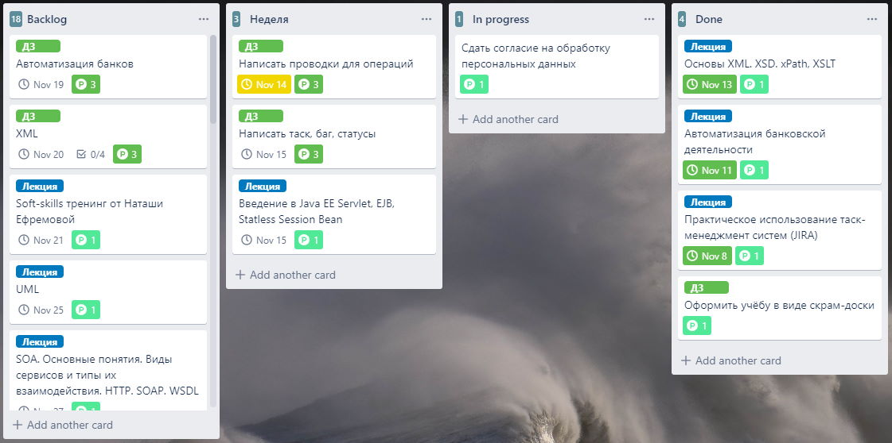

# Подробнее про Agile, Kanban 06.11.2019 Нечаева Наталья

## Задание

Оформить обучение в УЦ в виде Scrum-доски

## Решение

Было решено использовать Trello, так как у меня уже есть опыт работы с ним - там я веду список дел по дому и учёбе в универе.

[Ссылка на получившуюся доску](https://trello.com/b/n7bmEunJ)

