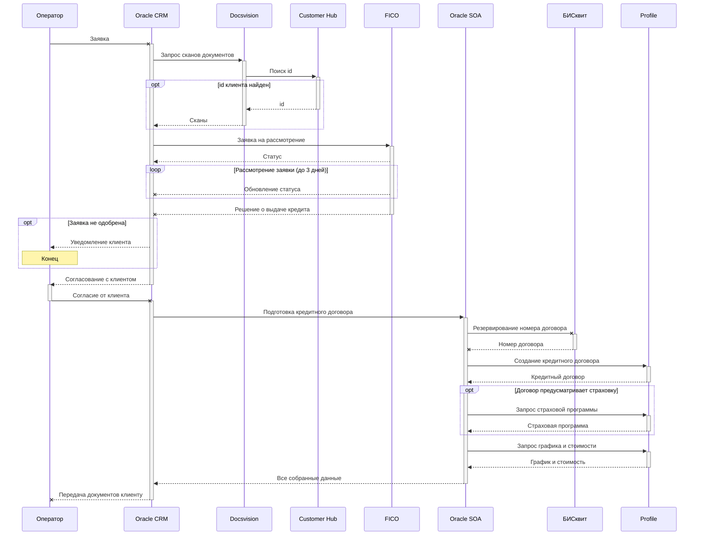

## Автоматизация банковской деятельности 11.11.2019 Федорова Ирина

## Задание 

Описать сценарии взаимодействия информационных систем в рамках бизнес-процесса "Рассмотрение кредитной заявки и оформление кредитного договора".

Ограничения: 
•	В системе CRM не хранятся идентификаторы клиента в других ИС банка.  Для получения идентификаторов клиента необходимо вызвать систему Customer Hub.
•	Все взаимодействия ИС между собой осуществляются через Oracle SOA Suite.
Описание бизнес - процесса:
Клиент оформляет кредитную заявку в отделении банка. Оформление осуществляется через систему CRM. После чего заявка из CRM в синхронном режиме должна быть передана на рассмотрение в кредитный конвейер. Предварительно, перед передачей заявки в кредитный конвейер необходимо в системе Docsvision получить сканы документов, удостоверяющих личность клиента (паспорт). Поиск документов осуществляется по идентификатору клиента в системе Docsvision, возможна ситуация отсутствия данного идентификатора, в этом случае заявка передается без сканов документов. Отправка заявки в КК осуществляется в синхронном режиме, в ответе КК должен вернуть статус, что заявка принята в работу, либо ошибку с описанием причины. Статус необходимо вернуть в систему CRM. 
Принятие решения по заявке в кредитном конвейере может проходить до 3-x рабочих дней. В течение этого времени из КК в асинхроном режиме в CRM передаются статусы по прохождению заявки различных проверок. В конечном итоге из КК в CRM должен быть передан финальный статус "Одобрена" либо "Отказ".

При одобрении заявки оповещение клиента осуществляется операторами CRM, средствами телефонии. При получении предварительного согласия клиента выполняется подготовка кредитного договора. Система CRM синхронно отправляет запрос на подготовку кредитного договора в Oracle SOA Suite, в которой должна быть реализована логика вызова различных ИС. В первую очередь необходимо вызвать БИСквит для резервирования номера договора. По полученному номеру договора вызывается Profile для создания кредитного договора. Если договор предусматривает страховку, то необходимо дополнительно вызывать Profile для получения страховой программы. Признак наличия страховки передается в запросе CRM на создание кредитного договора. Далее идет вызов Profile для получения графика погашения и полной стоимости кредита. Вся собранная информация затем передается в CRM

## Решение

Код на [Mermaid](https://github.com/mermaid-js/mermaid):

