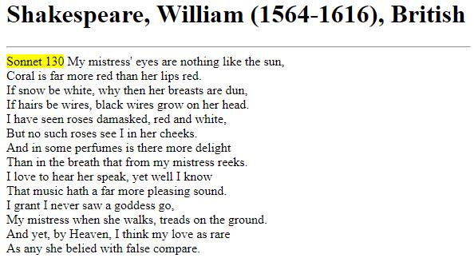
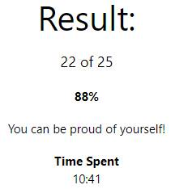
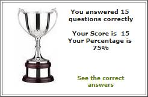

# Основы XML. XSD. xPath, XSLT 13.11.2019 Антон Таланов

## Содержание

- [Практика XML, XSD](#практика-xml-xsd)
	- [Задание 1](#задание-1)
	- [Решение](#решение)
	- [Задание 2](#задание-2)
	- [Решение](#решение-1)
- [Практика xPath, XSLT](#практика-xpath-xslt)
	- [Задание 1](#задание-1-1)
	- [Решение](#решение-2)
- [Домашнее задание XML, XSD, xPath, XSLT](#домашнее-задание-xml-xsd-xpath-xslt)
	- [Задание](#задание)
	- [Результаты](#результаты)

# Практика XML, XSD

## Задание 1

Создать следующий XML документ:

Корневой элемент - **shiporder** с атрибутом **orderid**. Элемент **shiporder** содержит три дочерних элемента: **orderperson**, **shipto** и **item**. Элемент **shipto** содержит элементы **name**, **city**, **country** и **address**. Элемент **item** содержит элемент **title**, **note**, **quantity** и **price**.

## Решение

```xml
<?xml version="1.0" encoding="UTF-8"?>
<shiporder orderid="889923">
  <orderperson>Ivan Ivanov</orderperson>
  <shipto>
    <name>Petr Petrov</name>
    <address>Pushkina 23</address>
    <city>Saratov</city>
    <country>Russia</country>
  </shipto>
  <item>
    <title>Cheese</title>
    <note>Cheddar with pepper</note>
    <quantity>3</quantity>
    <price>2</price>
  </item>
  <item>
    <title>Toaster</title>
    <quantity>1</quantity>
    <price>29.90</price>
  </item>
</shiporder>
```

## Задание 2

Для созданного в первом задании XML документа создадть схему, при этом введя следующие ограничения:
1. Типы элементов
	* orderid - string
	* orderperson - string 
	* name - string
	* address - string
	* city - string
	* country - string
	* title - string
	* note - string
	* quantity - positiveInteger
	* price - decimal
2. Длина значения элемента **address** должна быть **не менее 3 символов и не более 50 символов**
3. Элементы **name**, **city**, **orderperson**, **orderid** обязательные. Все остальные необязательные
4. Элемент **item** может использоваться неограниченное число раз
5. Элементы в **shiporder** должны быть в жесткой последовательности:
    1. orderperson
    2. shipto
    3. item


## Решение

[Проверить можно тут](https://www.liquid-technologies.com/online-xsd-validator)

```xml
<?xml version="1.0" encoding="UTF-8"?>
<xs:schema xmlns:xs="http://www.w3.org/2001/XMLSchema">
  <xs:element name="shiporder">
    <xs:complexType>
      <xs:sequence>
        <xs:element name="orderperson" type="xs:string"/>
        <xs:element name="shipto" type="shiptoType" minOccurs="0"/>
        <xs:element name="item" type="itemType" minOccurs="0" maxOccurs="unbounded"/>
      </xs:sequence>
      <xs:attribute name="orderid" type="xs:string" use="required"/>
    </xs:complexType>
  </xs:element>

  <xs:complexType name="shiptoType">
    <xs:all>
      <xs:element name="name" type="xs:string"/>
      <xs:element name="city" type="xs:string"/>
      <xs:element name="country" type="xs:string" minOccurs="0"/>
      <xs:element name="address" minOccurs="0">
        <xs:simpleType>
          <xs:restriction base="xs:string">
            <xs:minLength value = "3"/>
            <xs:maxLength value = "50"/>
          </xs:restriction>
        </xs:simpleType>
      </xs:element>
    </xs:all>
  </xs:complexType>

  <xs:complexType name="itemType">
    <xs:all>
      <xs:element name="title" type="xs:string" minOccurs="0"/>
      <xs:element name="note" type="xs:string" minOccurs="0"/>
      <xs:element name="quantity" type="xs:positiveInteger" minOccurs="0"/>
      <xs:element name="price" type="xs:decimal" minOccurs="0"/>
    </xs:all>
  </xs:complexType>
</xs:schema>
```

# Практика xPath, XSLT

## Задание 1

Взять в качестве исходного документа XML ниже. Написать XSLT файл для получения из XML документа, документа HTML, с текстом из первоначального документа.

```xml
<?xml version="1.0" encoding="UTF-8"?>
<sonnet type="Shakespearean">
  <author>
    <lastName>Shakespeare</lastName>
    <firstName>William</firstName>
    <nationality>British</nationality>
    <yearOfBirth>1564</yearOfBirth>
    <yearOfDeath>1616</yearOfDeath>
  </author>
  <title>Sonnet 130</title>
  <lines>
    <line>My mistress' eyes are nothing like the sun,</line>
    <line>Coral is far more red than her lips red.</line>
    <line>If snow be white, why then her breasts are dun,</line>
    <line>If hairs be wires, black wires grow on her head.</line>
    <line>I have seen roses damasked, red and white,</line>
    <line>But no such roses see I in her cheeks.</line>
    <line>And in some perfumes is there more delight</line>
    <line>Than in the breath that from my mistress reeks.</line>
    <line>I love to hear her speak, yet well I know</line>
    <line>That music hath a far more pleasing sound.</line>
    <line>I grant I never saw a goddess go,</line>
    <line>My mistress when she walks, treads on the ground.</line>
    <line>And yet, by Heaven, I think my love as rare</line>
    <line>As any she belied with false compare.</line>
  </lines>
</sonnet>
```

## Решение

```xml
<?xml version="1.0" encoding="UTF-8"?>
<xsl:stylesheet version="1.0" xmlns:xsl="http://www.w3.org/1999/XSL/Transform">
  <xsl:template match="/">
    <html>
      <body>
        <xsl:apply-templates/>
      </body>
    </html>
  </xsl:template>

  <xsl:template match="author">
    <h1>
      <xsl:value-of select="concat(lastName, &apos;, &apos;, firstName, &apos; (&apos;, yearOfBirth, &apos;-&apos;,yearOfDeath, &apos;), &apos;, nationality)"/>
    </h1>
    <hr/>
  </xsl:template>

  <xsl:template match="title">
    <span style="background-color:yellow">
      <xsl:value-of select="."/>
    </span>
  </xsl:template>

  <xsl:template match="lines">
      <xsl:for-each select="line">
        <xsl:value-of select="."/> <br/>
    </xsl:for-each>
  </xsl:template>
</xsl:stylesheet>
```

Прогоняем входные данные через [этот сайт](https://www.liquid-technologies.com/online-xsd-validator), получаем такой html файл:

```html
<html>
   <body>
      <h1>Shakespeare, William (1564-1616), British</h1>
      <hr/>
      <span style="background-color:yellow">Sonnet 130</span>
  My mistress' eyes are nothing like the sun,<br/>Coral is far more red than her lips red.<br/>If snow be white, why then her breasts are dun,<br/>If hairs be wires, black wires grow on her head.<br/>I have seen roses damasked, red and white,<br/>But no such roses see I in her cheeks.<br/>And in some perfumes is there more delight<br/>Than in the breath that from my mistress reeks.<br/>I love to hear her speak, yet well I know<br/>That music hath a far more pleasing sound.<br/>I grant I never saw a goddess go,<br/>My mistress when she walks, treads on the ground.<br/>And yet, by Heaven, I think my love as rare<br/>As any she belied with false compare.<br/>
   </body>
</html>
```



# Домашнее задание XML, XSD, xPath, XSLT

## Задание

Пройти тесты:
1. [XML](https://www.w3schools.com/quiztest/quiztest.asp?qtest=XML)
2. [XSD](http://www.academictutorials.com/quiz.asp?id=25)
3. [xPath](http://www.quizful.net/test/xpath_basics)
4. [XSLT](http://www.quizful.net/test/xsl_xslt)

## Результаты

1. [XML](https://www.w3schools.com/quiztest/quiztest.asp?qtest=XML)



2. [XSD](http://www.academictutorials.com/quiz.asp?id=25)



3. [xPath](http://www.quizful.net/test/xpath_basics) и 4. [XSLT](http://www.quizful.net/test/xsl_xslt)
	Что бы проходить тесты на этом сайте, нужно или задонатить, или копирайтить на форуме. 

