# Решения лаб по PL/SQL

- [Лаба 1](#лаба-1)
- [Лаба 2](#лаба-2)
- [Лаба 3](#лаба-3)
- [Лаба 4](#лаба-4)
- [Лаба 5](#лаба-5)
- [Лаба 6](#лаба-6)
- [Лаба 7](#лаба-7)
- [Лаба 8](#лаба-8)
- [Лаба 9](#лаба-9)
- [Лаба 10](#лаба-10)
- [Лаба 11](#лаба-11)
- [Лаба 12](#лаба-12)
- [Лаба 13](#лаба-13)
- [Лаба 14](#лаба-14)
- [Лаба 15](#лаба-15)
- [Лаба 16](#лаба-16)
- [Лаба 17](#лаба-17)
- [Лаба 18](#лаба-18)
- [Лаба 19](#лаба-19)
- [Лаба 20](#лаба-20)

## Лаба 1

1. г
2. 
```sql
SET SERVEROUTPUT ON
BEGIN
    DBMS_OUTPUT.PUT_LINE('Hello World');
END;
```
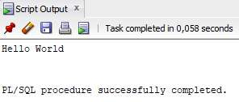

## Лаба 2

1. Правильные: а,б,д,ж,з. Неправильные: в,г,е
2. б,в
3. б
4. 
```sql
SET SERVEROUTPUT ON
DECLARE
    v_today DATE := SYSDATE;
    v_tomorrow v_today%TYPE;
BEGIN
    v_tomorrow := v_today + 1;
    DBMS_OUTPUT.PUT_LINE('Hello World');
    DBMS_OUTPUT.PUT_LINE('Today: ' || v_today);
    DBMS_OUTPUT.PUT_LINE('Tomorrow: ' || v_tomorrow);
END;
```
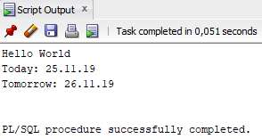

5.

```sql
SET SERVEROUTPUT ON
VARIABLE b_basic_percent NUMBER
VARIABLE b_pf_percent NUMBER
DECLARE
    v_today DATE := SYSDATE;
    v_tomorrow v_today%TYPE;
BEGIN
    v_tomorrow := v_today + 1;
    DBMS_OUTPUT.PUT_LINE('Hello World');
    DBMS_OUTPUT.PUT_LINE('Today: ' || v_today);
    DBMS_OUTPUT.PUT_LINE('Tomorrow: ' || v_tomorrow);
    :b_basic_percent := 45;
    :b_pf_percent := 12;
END;
/
PRINT b_basic_percent
PRINT b_pf_percent
```
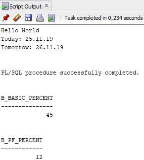

## Лаба 3

1.
```
а. v_weight = 2 (NUMBER)
б. v_new_locn = 'Western Europe' (VARCHAR2)
в. v_weight = 601 (NUMBER)
г. v_message = 'Product 10012 is in stock' (VARCHAR2)
д. v_new_locn вне зоны видимости
```
2.
```
а. customer = 201 (NUMBER)
б. name = 'Unisports' (VARCHAR2)
в. credit_rating = 'GOOD' (VARCHAR2)
г. customer = 'Womansport' (VARCHAR2)
д. name вне зоны видимости
е. credit_rating = 'GOOD' (VARCHAR2)
```
3.
```sql
SET SERVEROUTPUT ON
--VARIABLE b_basic_percent NUMBER
--VARIABLE b_pf_percent NUMBER
DECLARE
      v_basic_percent NUMBER := 45;
      v_pf_percent NUMBER := 12;
      v_fname VARCHAR2(15);
      v_emp_sal NUMBER(10);
BEGIN
      SELECT first_name, salary INTO v_fname, v_emp_sal
      FROM employees WHERE employee_id=110;
      DBMS_OUTPUT.PUT_LINE('Hello ' || v_fname);
      DBMS_OUTPUT.PUT_LINE('Salary : ' || v_emp_sal);
      DBMS_OUTPUT.PUT_LINE('Pf: ' || v_emp_sal*v_basic_percent/100*v_pf_percent/100);
      /*
      :b_basic_percent := 45;
      :b_pf_percent := 12;
      */
END;
```
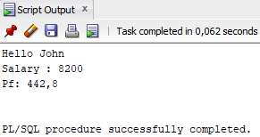

## Лаба 4

1.
```sql
SET SERVEROUTPUT ON
DECLARE
    v_max_deptno NUMBER;
BEGIN
    SELECT MAX(department_id) INTO v_max_deptno FROM departments;
    DBMS_OUTPUT.PUT_LINE('Max: ' || v_max_deptno);
END;
```
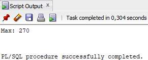

2.
```sql
SET SERVEROUTPUT ON
DECLARE
    v_max_deptno NUMBER;
    v_dept_name departments.department_name%TYPE := 'Education';
    v_dept_id NUMBER;
BEGIN
    SELECT MAX(department_id) INTO v_max_deptno FROM departments;
    v_dept_id := v_max_deptno + 10;
    INSERT INTO departments(department_name, department_id, location_id)
    VALUES (v_dept_name, v_dept_id, NULL);
    DBMS_OUTPUT.PUT_LINE('Rows inserted: ' || SQL%ROWCOUNT);
END;
/
SELECT * FROM departments where department_name = 'Education';
```
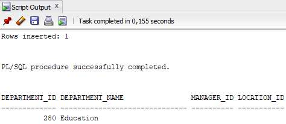

3.
```sql
SET SERVEROUTPUT ON
DECLARE
    v_max_deptno NUMBER;
    v_dept_name departments.department_name%TYPE := 'Education';
    v_dept_id NUMBER;
BEGIN
    SELECT MAX(department_id) INTO v_max_deptno FROM departments;
    v_dept_id := v_max_deptno;
    UPDATE departments SET location_id=3000 WHERE department_id=v_dept_id;
END;
/
SELECT * FROM departments where department_name = 'Education';
DELETE FROM departments where department_name = 'Education';
```
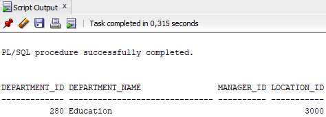

## Лаба 5

1.
```sql
SET SERVEROUTPUT ON
BEGIN
    FOR i in 1..10 LOOP
        IF i NOT IN (6, 8) THEN
            INSERT INTO messages VALUES (i);
        END IF;
    END LOOP;
    COMMIT;
END;
/
SELECT * FROM messages;
```
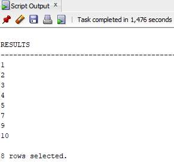

2.
```sql
SET SERVEROUTPUT ON
DECLARE
    v_empno emp.employee_id%TYPE := 176;
    v_asterisk emp.stars%TYPE := NULL;
    v_sal emp.salary%TYPE;
BEGIN
    SELECT NVL(ROUND(salary/1000), 0) INTO v_sal
    FROM emp WHERE employee_id = v_empno;
    FOR i IN 1..v_sal LOOP
        v_asterisk := v_asterisk || '*';
    END LOOP;
    UPDATE emp SET stars = v_asterisk WHERE employee_id = v_empno;
    COMMIT;
END;
/
SELECT employee_id,salary, stars FROM emp WHERE employee_id=176;
```

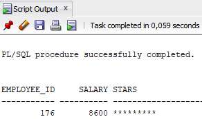

## Лаба 6

1.
```sql
SET SERVEROUTPUT ON
DECLARE
    v_country_record countries%ROWTYPE;
    v_countryid varchar2(2):= 'CA';
BEGIN
    SELECT * INTO v_country_record FROM countries
    WHERE country_id = v_countryid;
    DBMS_OUTPUT.PUT_LINE('Country Id: ' || v_country_record.country_id);
    DBMS_OUTPUT.PUT_LINE('Country Name: ' || v_country_record.country_name);
    DBMS_OUTPUT.PUT_LINE('Region: ' || v_country_record.region_id);
END;
```
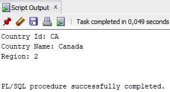

2.
```sql
SET SERVEROUTPUT ON
DECLARE
    TYPE dept_table_type IS TABLE OF departments.department_name%TYPE INDEX BY PLS_INTEGER;
    my_dept_table dept_table_type;
    f_loop_count NUMBER := 10;
    v_deptno NUMBER := 0;
BEGIN
    FOR i IN 1..f_loop_count LOOP
        v_deptno := v_deptno + 10;
        SELECT department_name INTO my_dept_table(i)
        FROM departments WHERE department_id = v_deptno;
    END LOOP;
    FOR i IN 1..f_loop_count LOOP
        DBMS_OUTPUT.PUT_LINE(my_dept_table(i));
    END LOOP;
END;
```
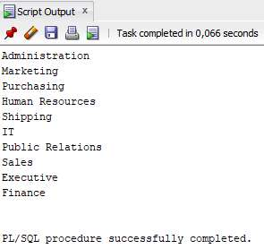

3.
```sql
SET SERVEROUTPUT ON
DECLARE
    TYPE dept_table_type IS TABLE OF departments%ROWTYPE INDEX BY PLS_INTEGER;
    my_dept_table dept_table_type;
    f_loop_count NUMBER := 10;
    v_deptno NUMBER := 0;
BEGIN
    FOR i IN 1..f_loop_count LOOP
        v_deptno := v_deptno + 10;
        SELECT * INTO my_dept_table(i) FROM departments
        WHERE department_id = v_deptno;
    END LOOP;
    FOR i IN 1..f_loop_count LOOP
        DBMS_OUTPUT.PUT_LINE ('Department Number: ' || my_dept_table(i).department_id
        || ', Department Name: ' || my_dept_table(i).department_name
        || ', Manager Id: '|| my_dept_table(i).manager_id
        || ', Location Id: ' || my_dept_table(i).location_id);
    END LOOP;
END;
```
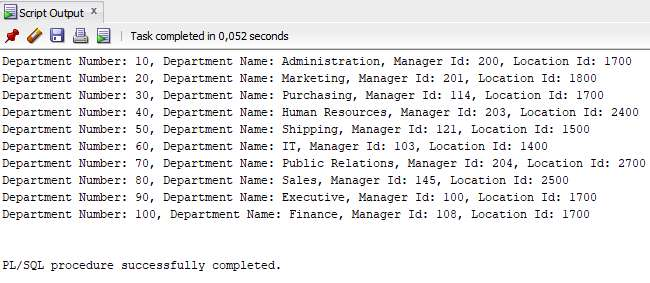

## Лаба 7

1.
```sql
SET SERVEROUTPUT ON
DECLARE
    v_num NUMBER := 5;
    v_sal employees.salary%TYPE;
    CURSOR c_emp_cursor IS
        SELECT DISTINCT salary
        FROM employees
        ORDER BY salary DESC;
BEGIN
    OPEN c_emp_cursor;
    FETCH c_emp_cursor INTO v_sal;
    WHILE c_emp_cursor%ROWCOUNT <= v_num AND c_emp_cursor%FOUND LOOP
        INSERT INTO top_salaries(salary) VALUES (v_sal);
        FETCH c_emp_cursor INTO v_sal;
    END LOOP;
    CLOSE c_emp_cursor;
END;
/
SELECT * FROM top_salaries;
TRUNCATE TABLE top_salaries;
```
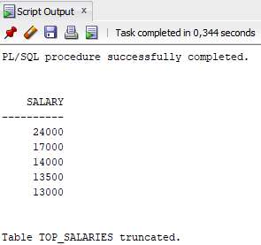

2.
```sql
SET SERVEROUTPUT ON
DECLARE
    V_deptno NUMBER := &p_deptno;
    CURSOR c_emp_cursor IS
        SELECT last_name, salary, manager_id
        FROM employees
        WHERE department_id = v_deptno;
BEGIN
    FOR emp_record IN c_emp_cursor LOOP
        IF emp_record.salary < 5000 AND (emp_record.manager_id IN (101, 124)) THEN
            DBMS_OUTPUT.PUT_LINE (emp_record.last_name || ' Due for a raise');
        ELSE
            DBMS_OUTPUT.PUT_LINE (emp_record.last_name || ' Not Due for a raise');
        END IF;
    END LOOP;
END;
```
.jpg

3.
```sql
SET SERVEROUTPUT ON
DECLARE
    CURSOR c_dept_cursor IS
        SELECT department_id,department_name
        FROM departments
        WHERE department_id < 100
        ORDER BY department_id;
    CURSOR c_emp_cursor(v_deptno NUMBER) IS
        SELECT last_name, job_id, hire_date, salary
        FROM employees
        WHERE department_id = v_deptno
        AND employee_id < 120;
    v_current_deptno departments.department_id%TYPE;
    v_current_dname departments.department_name%TYPE;
    v_ename employees.last_name%TYPE;
    v_job employees.job_id%TYPE;
    v_hiredate employees.hire_date%TYPE;
    v_sal employees.salary%TYPE;
BEGIN
    OPEN c_dept_cursor;
    LOOP
        FETCH c_dept_cursor INTO v_current_deptno,v_current_dname;
        EXIT WHEN c_dept_cursor%NOTFOUND;
        DBMS_OUTPUT.PUT_LINE ('Department: ' || v_current_deptno || ' ' || v_current_dname);
        IF c_emp_cursor%ISOPEN THEN
            CLOSE c_emp_cursor;
        END IF;
        OPEN c_emp_cursor (v_current_deptno);
        LOOP
            FETCH c_emp_cursor INTO v_ename, v_job, v_hiredate, v_sal;
            EXIT WHEN c_emp_cursor%NOTFOUND;
            DBMS_OUTPUT.PUT_LINE (v_ename || ' ' || v_job || ' ' || v_hiredate || ' ' || v_sal);
        END LOOP;
        DBMS_OUTPUT.PUT_LINE('----------------------------------------------------------------------------------------');
        CLOSE c_emp_cursor;       
    END LOOP;
    CLOSE c_dept_cursor;
END;
```
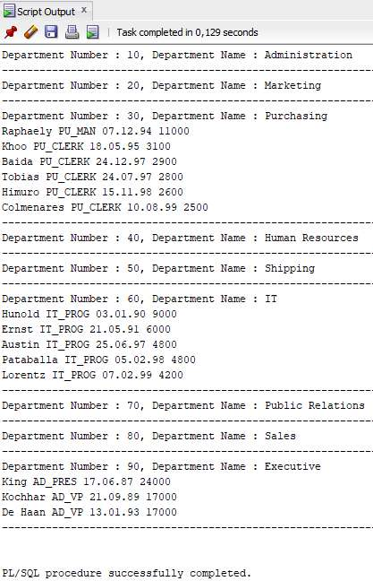

