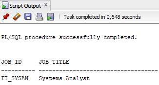
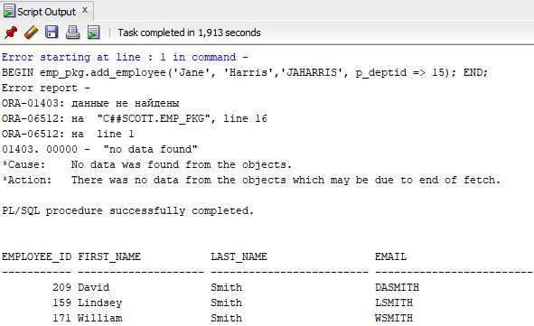
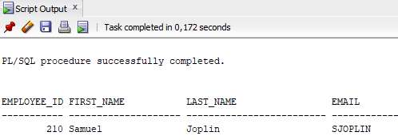
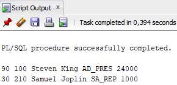
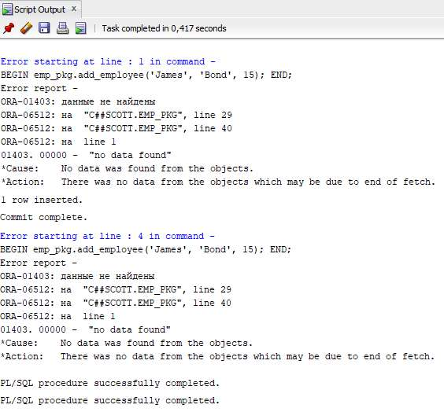
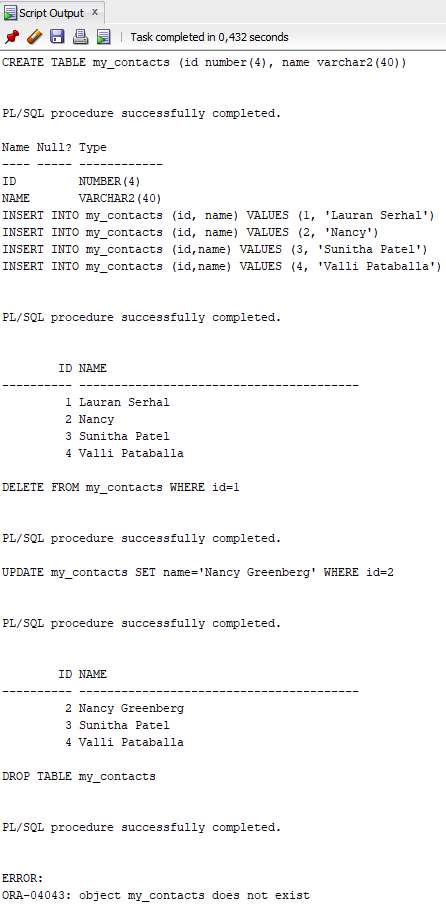
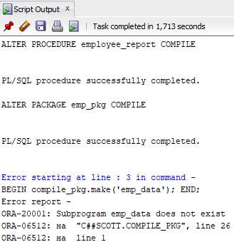

# Решения лаб по PL/SQL

- [Лаба 1](#лаба-1)
- [Лаба 2](#лаба-2)
- [Лаба 3](#лаба-3)
- [Лаба 4](#лаба-4)
- [Лаба 5](#лаба-5)
- [Лаба 6](#лаба-6)
- [Лаба 7](#лаба-7)
- [Лаба 8](#лаба-8)
- [Лаба 9](#лаба-9)
- [Лаба 10](#лаба-10)
- [Лаба 11](#лаба-11)
- [Лаба 12](#лаба-12)
- [Лаба 13](#лаба-13)
- [Лаба 14](#лаба-14)
- [Лаба 15](#лаба-15)
- [Лаба 16](#лаба-16)
- [Лаба 17](#лаба-17)
- [Лаба 18](#лаба-18)
- [Лаба 19](#лаба-19)
- [Лаба 20](#лаба-20)

## Лаба 1

1. г
2. 
```sql
SET SERVEROUTPUT ON
BEGIN
    DBMS_OUTPUT.PUT_LINE('Hello World');
END;
```


## Лаба 2

1. Правильные: а,б,д,ж,з. Неправильные: в,г,е
2. б,в
3. б
4. 
```sql
SET SERVEROUTPUT ON
DECLARE
    v_today DATE := SYSDATE;
    v_tomorrow v_today%TYPE;
BEGIN
    v_tomorrow := v_today + 1;
    DBMS_OUTPUT.PUT_LINE('Hello World');
    DBMS_OUTPUT.PUT_LINE('Today: ' || v_today);
    DBMS_OUTPUT.PUT_LINE('Tomorrow: ' || v_tomorrow);
END;
```


5.

```sql
SET SERVEROUTPUT ON
VARIABLE b_basic_percent NUMBER
VARIABLE b_pf_percent NUMBER
DECLARE
    v_today DATE := SYSDATE;
    v_tomorrow v_today%TYPE;
BEGIN
    v_tomorrow := v_today + 1;
    DBMS_OUTPUT.PUT_LINE('Hello World');
    DBMS_OUTPUT.PUT_LINE('Today: ' || v_today);
    DBMS_OUTPUT.PUT_LINE('Tomorrow: ' || v_tomorrow);
    :b_basic_percent := 45;
    :b_pf_percent := 12;
END;
/
PRINT b_basic_percent
PRINT b_pf_percent
```


## Лаба 3

1.
```
а. v_weight = 2 (NUMBER)
б. v_new_locn = 'Western Europe' (VARCHAR2)
в. v_weight = 601 (NUMBER)
г. v_message = 'Product 10012 is in stock' (VARCHAR2)
д. v_new_locn вне зоны видимости
```
2.
```
а. customer = 201 (NUMBER)
б. name = 'Unisports' (VARCHAR2)
в. credit_rating = 'GOOD' (VARCHAR2)
г. customer = 'Womansport' (VARCHAR2)
д. name вне зоны видимости
е. credit_rating = 'GOOD' (VARCHAR2)
```
3.
```sql
SET SERVEROUTPUT ON
--VARIABLE b_basic_percent NUMBER
--VARIABLE b_pf_percent NUMBER
DECLARE
      v_basic_percent NUMBER := 45;
      v_pf_percent NUMBER := 12;
      v_fname VARCHAR2(15);
      v_emp_sal NUMBER(10);
BEGIN
      SELECT first_name, salary INTO v_fname, v_emp_sal
      FROM employees WHERE employee_id=110;
      DBMS_OUTPUT.PUT_LINE('Hello ' || v_fname);
      DBMS_OUTPUT.PUT_LINE('Salary : ' || v_emp_sal);
      DBMS_OUTPUT.PUT_LINE('Pf: ' || v_emp_sal*v_basic_percent/100*v_pf_percent/100);
      /*
      :b_basic_percent := 45;
      :b_pf_percent := 12;
      */
END;
```


## Лаба 4

1.
```sql
SET SERVEROUTPUT ON
DECLARE
    v_max_deptno NUMBER;
BEGIN
    SELECT MAX(department_id) INTO v_max_deptno FROM departments;
    DBMS_OUTPUT.PUT_LINE('Max: ' || v_max_deptno);
END;
```


2.
```sql
SET SERVEROUTPUT ON
DECLARE
    v_max_deptno NUMBER;
    v_dept_name departments.department_name%TYPE := 'Education';
    v_dept_id NUMBER;
BEGIN
    SELECT MAX(department_id) INTO v_max_deptno FROM departments;
    v_dept_id := v_max_deptno + 10;
    INSERT INTO departments(department_name, department_id, location_id)
    VALUES (v_dept_name, v_dept_id, NULL);
    DBMS_OUTPUT.PUT_LINE('Rows inserted: ' || SQL%ROWCOUNT);
END;
/
SELECT * FROM departments where department_name = 'Education';
```


3.
```sql
SET SERVEROUTPUT ON
DECLARE
    v_max_deptno NUMBER;
    v_dept_name departments.department_name%TYPE := 'Education';
    v_dept_id NUMBER;
BEGIN
    SELECT MAX(department_id) INTO v_max_deptno FROM departments;
    v_dept_id := v_max_deptno;
    UPDATE departments SET location_id=3000 WHERE department_id=v_dept_id;
END;
/
SELECT * FROM departments where department_name = 'Education';
DELETE FROM departments where department_name = 'Education';
```


## Лаба 5

1.
```sql
SET SERVEROUTPUT ON
BEGIN
    FOR i in 1..10 LOOP
        IF i NOT IN (6, 8) THEN
            INSERT INTO messages VALUES (i);
        END IF;
    END LOOP;
    COMMIT;
END;
/
SELECT * FROM messages;
```


2.
```sql
SET SERVEROUTPUT ON
DECLARE
    v_empno emp.employee_id%TYPE := 176;
    v_asterisk emp.stars%TYPE := NULL;
    v_sal emp.salary%TYPE;
BEGIN
    SELECT NVL(ROUND(salary/1000), 0) INTO v_sal
    FROM emp WHERE employee_id = v_empno;
    FOR i IN 1..v_sal LOOP
        v_asterisk := v_asterisk || '*';
    END LOOP;
    UPDATE emp SET stars = v_asterisk WHERE employee_id = v_empno;
    COMMIT;
END;
/
SELECT employee_id,salary, stars FROM emp WHERE employee_id=176;
```


## Лаба 6

1.
```sql
SET SERVEROUTPUT ON
DECLARE
    v_country_record countries%ROWTYPE;
    v_countryid varchar2(2):= 'CA';
BEGIN
    SELECT * INTO v_country_record FROM countries
    WHERE country_id = v_countryid;
    DBMS_OUTPUT.PUT_LINE('Country Id: ' || v_country_record.country_id);
    DBMS_OUTPUT.PUT_LINE('Country Name: ' || v_country_record.country_name);
    DBMS_OUTPUT.PUT_LINE('Region: ' || v_country_record.region_id);
END;
```


2.
```sql
SET SERVEROUTPUT ON
DECLARE
    TYPE dept_table_type IS TABLE OF departments.department_name%TYPE INDEX BY PLS_INTEGER;
    my_dept_table dept_table_type;
    f_loop_count NUMBER := 10;
    v_deptno NUMBER := 0;
BEGIN
    FOR i IN 1..f_loop_count LOOP
        v_deptno := v_deptno + 10;
        SELECT department_name INTO my_dept_table(i)
        FROM departments WHERE department_id = v_deptno;
    END LOOP;
    FOR i IN 1..f_loop_count LOOP
        DBMS_OUTPUT.PUT_LINE(my_dept_table(i));
    END LOOP;
END;
```


3.
```sql
SET SERVEROUTPUT ON
DECLARE
    TYPE dept_table_type IS TABLE OF departments%ROWTYPE INDEX BY PLS_INTEGER;
    my_dept_table dept_table_type;
    f_loop_count NUMBER := 10;
    v_deptno NUMBER := 0;
BEGIN
    FOR i IN 1..f_loop_count LOOP
        v_deptno := v_deptno + 10;
        SELECT * INTO my_dept_table(i) FROM departments
        WHERE department_id = v_deptno;
    END LOOP;
    FOR i IN 1..f_loop_count LOOP
        DBMS_OUTPUT.PUT_LINE ('Department Number: ' || my_dept_table(i).department_id
        || ', Department Name: ' || my_dept_table(i).department_name
        || ', Manager Id: '|| my_dept_table(i).manager_id
        || ', Location Id: ' || my_dept_table(i).location_id);
    END LOOP;
END;
```


## Лаба 7

1.
```sql
SET SERVEROUTPUT ON
DECLARE
    v_num NUMBER := 5;
    v_sal employees.salary%TYPE;
    CURSOR c_emp_cursor IS
        SELECT DISTINCT salary
        FROM employees
        ORDER BY salary DESC;
BEGIN
    OPEN c_emp_cursor;
    FETCH c_emp_cursor INTO v_sal;
    WHILE c_emp_cursor%ROWCOUNT <= v_num AND c_emp_cursor%FOUND LOOP
        INSERT INTO top_salaries(salary) VALUES (v_sal);
        FETCH c_emp_cursor INTO v_sal;
    END LOOP;
    CLOSE c_emp_cursor;
END;
/
SELECT * FROM top_salaries;
TRUNCATE TABLE top_salaries;
```


2.
```sql
SET SERVEROUTPUT ON
DECLARE
    V_deptno NUMBER := &p_deptno;
    CURSOR c_emp_cursor IS
        SELECT last_name, salary, manager_id
        FROM employees
        WHERE department_id = v_deptno;
BEGIN
    FOR emp_record IN c_emp_cursor LOOP
        IF emp_record.salary < 5000 AND (emp_record.manager_id IN (101, 124)) THEN
            DBMS_OUTPUT.PUT_LINE (emp_record.last_name || ' Due for a raise');
        ELSE
            DBMS_OUTPUT.PUT_LINE (emp_record.last_name || ' Not Due for a raise');
        END IF;
    END LOOP;
END;
```


3.
```sql
SET SERVEROUTPUT ON
DECLARE
    CURSOR c_dept_cursor IS
        SELECT department_id,department_name
        FROM departments
        WHERE department_id < 100
        ORDER BY department_id;
    CURSOR c_emp_cursor(v_deptno NUMBER) IS
        SELECT last_name, job_id, hire_date, salary
        FROM employees
        WHERE department_id = v_deptno
        AND employee_id < 120;
    v_current_deptno departments.department_id%TYPE;
    v_current_dname departments.department_name%TYPE;
    v_ename employees.last_name%TYPE;
    v_job employees.job_id%TYPE;
    v_hiredate employees.hire_date%TYPE;
    v_sal employees.salary%TYPE;
BEGIN
    OPEN c_dept_cursor;
    LOOP
        FETCH c_dept_cursor INTO v_current_deptno,v_current_dname;
        EXIT WHEN c_dept_cursor%NOTFOUND;
        DBMS_OUTPUT.PUT_LINE ('Department: ' || v_current_deptno || ' ' || v_current_dname);
        IF c_emp_cursor%ISOPEN THEN
            CLOSE c_emp_cursor;
        END IF;
        OPEN c_emp_cursor (v_current_deptno);
        LOOP
            FETCH c_emp_cursor INTO v_ename, v_job, v_hiredate, v_sal;
            EXIT WHEN c_emp_cursor%NOTFOUND;
            DBMS_OUTPUT.PUT_LINE (v_ename || ' ' || v_job || ' ' || v_hiredate || ' ' || v_sal);
        END LOOP;
        DBMS_OUTPUT.PUT_LINE('----------------------------------------------------------------------------------------');
        CLOSE c_emp_cursor;       
    END LOOP;
    CLOSE c_dept_cursor;
END;
```


## Лаба 8

1.
```sql
SET SERVEROUTPUT ON
TRUNCATE TABLE messages;
DECLARE
    v_ename employees.last_name%TYPE;
    v_emp_sal employees.salary%TYPE := 6000;
BEGIN
    SELECT last_name INTO v_ename FROM employees WHERE salary = v_emp_sal;
    INSERT INTO messages (results) VALUES (v_ename || ' - ' || v_emp_sal);
EXCEPTION
    WHEN NO_DATA_FOUND THEN
        INSERT INTO messages VALUES ('No employee with a salary of ' || TO_CHAR(v_emp_sal));
    WHEN TOO_MANY_ROWS THEN
        INSERT INTO messages (results) VALUES ('More than one employee with a salary of ' || TO_CHAR(v_emp_sal));
    WHEN OTHERS THEN
        INSERT INTO messages (results) VALUES ('Some other error occurred.');
END;
/
SELECT * FROM messages;
```


2.
```sql
SET SERVEROUTPUT ON
DECLARE
    e_childrecord_exists EXCEPTION;
    PRAGMA EXCEPTION_INIT(e_childrecord_exists, -02292);
BEGIN
    DBMS_OUTPUT.PUT_LINE(' Удаление отдела 40........');
    DELETE FROM departments WHERE department_id=40;
EXCEPTION
    WHEN e_childrecord_exists THEN
        DBMS_OUTPUT.PUT_LINE(' Cannot delete this department. There are employees in this department (child records exist.)');
END;
```


## Лаба 9

1.
```sql
CREATE OR REPLACE PROCEDURE add_job (
    p_job_id jobs.job_id%TYPE,
    p_job_title jobs.job_title%TYPE) IS
BEGIN
    INSERT INTO jobs (job_id, job_title) VALUES (p_job_id, p_job_title);
    COMMIT;
END add_job;
```
```sql
EXECUTE add_job('IT_DBA', 'Database Administrator')
SELECT * FROM jobs WHERE job_id = 'IT_DBA';
EXECUTE add_job ('ST_MAN', 'Stock Manager')
```


В таблице jobs уже есть запись с job_id= 'ST_MAN' с ограничением UNIQUE

2.
```sql
CREATE OR REPLACE PROCEDURE upd_job(
    p_job_id IN jobs.job_id%TYPE,
    p_job_title IN jobs.job_title%TYPE) IS
BEGIN
    UPDATE jobs SET job_title = p_job_title WHERE job_id = p_job_id;
    IF SQL%NOTFOUND THEN
        RAISE NO_DATA_FOUND;
    END IF;
END upd_job;
```
```sql
EXECUTE upd_job ('IT_DBA', 'Data Administrator')
SELECT * FROM jobs WHERE job_id = 'IT_DBA';
EXECUTE upd_job ('IT_WEB', 'Web Master')
```


3.
```sql
CREATE OR REPLACE PROCEDURE del_job (
    p_jobid jobs.job_id%TYPE) IS
BEGIN
    DELETE FROM jobs WHERE job_id = p_jobid;
    IF SQL%NOTFOUND THEN
        RAISE NO_DATA_FOUND;
    END IF;
END del_job;
```
```sql
EXECUTE del_job ('IT_DBA')
SELECT * FROM jobs WHERE job_id = 'IT_DBA';
EXECUTE del_job ('IT_WEB')
```


4.
```sql
CREATE OR REPLACE PROCEDURE get_employee(
    p_emp_id IN employees.employee_id%TYPE,
    p_sal  OUT employees.salary%TYPE,
    p_job  OUT employees.job_id%TYPE) IS
BEGIN
    SELECT salary, job_id INTO p_sal, p_job FROM employees WHERE employee_id = p_emp_id;
END get_employee;
```
```sql
VARIABLE v_salary NUMBER
VARIABLE v_job VARCHAR2(15)

EXECUTE get_employee(120, :v_salary, :v_job)
PRINT v_salary v_job;
EXECUTE get_employee(300, :v_salary, :v_job)
```


Не найден работник с таким job_id

## Лаба 10

1.

```sql
CREATE OR REPLACE FUNCTION get_job(
    p_jobid jobs.job_id%type)
    RETURN jobs.job_title%type IS
    v_title jobs.job_title%type;
BEGIN
    SELECT job_title INTO v_title FROM jobs WHERE job_id = p_jobid;
    RETURN v_title;
END get_job;
```
```sql
VARIABLE b_title VARCHAR2(35)
EXECUTE :b_title := get_job ('SA_REP');
PRINT b_title
```


2.
```sql
CREATE OR REPLACE FUNCTION get_annual_comp(
    p_sal  employees.salary%TYPE,
    p_comm employees.commission_pct%TYPE)
    RETURN NUMBER IS
BEGIN
    RETURN (NVL(p_sal, 0) * 12 + (NVL(p_comm, 0) * NVL(p_sal, 0) * 12));
END get_annual_comp;
```
```sql
SELECT employee_id, last_name, get_annual_comp(salary,commission_pct) AS "Annual Compensation" FROM employees WHERE department_id = 30
```


3.
```sql
CREATE OR REPLACE FUNCTION valid_deptid(
    p_dept_id departments.department_id%TYPE)
    RETURN BOOLEAN IS
    v_temp departments.department_id%TYPE;
BEGIN
    SELECT 1 INTO v_temp FROM departments WHERE department_id = p_dept_id;
    RETURN TRUE;
EXCEPTION
    WHEN NO_DATA_FOUND THEN
        RETURN FALSE;
END valid_deptid;
```
```sql
CREATE OR REPLACE PROCEDURE add_employee(
    p_first_name employees.first_name%TYPE,
    p_last_name employees.last_name%TYPE,
    p_email employees.email%TYPE,
    p_job employees.job_id%TYPE DEFAULT 'SA_REP',
    p_mgr employees.manager_id%TYPE DEFAULT 145,
    p_sal employees.salary%TYPE DEFAULT 1000,
    p_comm employees.commission_pct%TYPE DEFAULT 0,
    p_deptid employees.department_id%TYPE DEFAULT 30) IS
BEGIN
    IF valid_deptid(p_deptid) THEN
        INSERT INTO employees(employee_id, first_name, last_name, email, job_id, manager_id, hire_date, salary, commission_pct, department_id)
        VALUES (employees_seq.NEXTVAL, p_first_name, p_last_name, p_email, p_job, p_mgr, TRUNC(SYSDATE), p_sal, p_comm, p_deptid);
    ELSE
        RAISE NO_DATA_FOUND;
    END IF;
END add_employee;
```
```sql
EXECUTE add_employee('Joe', 'Harris', 'JAHARRIS', p_deptid => 80)
SELECT first_name, last_name, email FROM employees WHERE first_name = 'Joe';
EXECUTE add_employee('Jane', 'Harris', 'JAHARRIS', p_deptid => 15)
```


Не найден отдел с id = 15

## Лаба 11

1.
```sql
CREATE OR REPLACE PACKAGE job_pkg IS
    PROCEDURE add_job(p_job_id jobs.job_id%TYPE, p_jobtitle jobs.job_title%TYPE);
    PROCEDURE del_job(p_job_id jobs.job_id%TYPE);
    PROCEDURE upd_job(p_job_id jobs.job_id%TYPE, p_jobtitle jobs.job_title%TYPE);
    FUNCTION  get_job(p_job_id jobs.job_id%type) RETURN jobs.job_title%type;
END job_pkg;
```
```sql
CREATE OR REPLACE PACKAGE BODY job_pkg AS
    PROCEDURE add_job(p_job_id jobs.job_id%TYPE, p_job_title jobs.job_title%TYPE) IS
    BEGIN
        INSERT INTO jobs (job_id, job_title) VALUES (p_job_id, p_job_title);
        COMMIT;
    END add_job;
    
    PROCEDURE del_job(p_job_id jobs.job_id%TYPE) IS
    BEGIN
        DELETE FROM jobs WHERE job_id = p_job_id;
        IF SQL%NOTFOUND THEN
            RAISE NO_DATA_FOUND;
        END IF;
    END del_job;
    
    PROCEDURE upd_job(p_job_id IN jobs.job_id%TYPE, p_job_title IN jobs.job_title%TYPE) IS
    BEGIN
        UPDATE jobs SET job_title = p_job_title WHERE job_id = p_job_id;
        IF SQL%NOTFOUND THEN
            RAISE NO_DATA_FOUND;
        END IF;
    END upd_job;
    
    FUNCTION get_job(p_job_id jobs.job_id%type) RETURN jobs.job_title%type
    IS v_title jobs.job_title%TYPE;
    BEGIN
        SELECT job_title INTO v_title FROM jobs WHERE job_id = p_job_id;
        RETURN v_title;
    END get_job;
END job_pkg;
```
```sql
EXECUTE job_pkg.add_job('IT_SYSAN', 'Systems Analyst')
SELECT * FROM jobs WHERE job_id = 'IT_SYSAN';
```


2.
```sql
CREATE OR REPLACE PACKAGE emp_pkg IS
    PROCEDURE add_employee(
        p_first_name employees.first_name%TYPE,
        p_last_name employees.last_name%TYPE,
        p_email employees.email%TYPE,
        p_job employees.job_id%TYPE DEFAULT 'SA_REP',
        p_mgr employees.manager_id%TYPE DEFAULT 145,
        p_sal employees.salary%TYPE DEFAULT 1000,
        p_comm employees.commission_pct%TYPE DEFAULT 0,
        p_dept_id employees.department_id%TYPE DEFAULT 30);
    PROCEDURE get_employee(
        p_emp_id IN employees.employee_id%TYPE,
        p_sal  OUT employees.salary%TYPE,
        p_job  OUT employees.job_id%TYPE);
END emp_pkg;
```
```sql
CREATE OR REPLACE PACKAGE BODY emp_pkg AS
    PROCEDURE add_employee(
        p_first_name employees.first_name%TYPE,
        p_last_name employees.last_name%TYPE,
        p_email employees.email%TYPE,
        p_job employees.job_id%TYPE DEFAULT 'SA_REP',
        p_mgr employees.manager_id%TYPE DEFAULT 145,
        p_sal employees.salary%TYPE DEFAULT 1000,
        p_comm employees.commission_pct%TYPE DEFAULT 0,
        p_dept_id employees.department_id%TYPE DEFAULT 30) IS
    BEGIN
        IF valid_deptid(p_dept_id) THEN
            INSERT INTO employees(employee_id, first_name, last_name, email, job_id, manager_id, hire_date, salary, commission_pct, department_id)
            VALUES (employees_seq.NEXTVAL, p_first_name, p_last_name, p_email, p_job, p_mgr, TRUNC(SYSDATE), p_sal, p_comm, p_dept_id);
        ELSE
            RAISE NO_DATA_FOUND;
        END IF;
    END add_employee;
    
    PROCEDURE get_employee(
        p_emp_id IN employees.employee_id%TYPE,
        p_sal  OUT employees.salary%TYPE,
        p_job  OUT employees.job_id%TYPE) IS
    BEGIN
        SELECT salary, job_id INTO p_sal, p_job FROM employees WHERE employee_id = p_emp_id;
    END get_employee;
END emp_pkg;
```
```sql
EXECUTE emp_pkg.add_employee('Jane', 'Harris','JAHARRIS', p_deptid => 15)
EXECUTE emp_pkg.add_employee('David', 'Smith','DASMITH', p_deptid => 80)
SELECT * FROM employees WHERE last_name = 'Smith';
```


## Лаба 12

1.
```sql
PROCEDURE add_employee(
    p_first_name employees.first_name%TYPE,
    p_last_name employees.last_name%TYPE,
    p_dept_id employees.department_id%TYPE);
```
```sql
PROCEDURE add_employee(
    p_first_name employees.first_name%TYPE,
    p_last_name employees.last_name%TYPE,
    p_dept_id employees.department_id%TYPE) IS
    p_email employees.email%type;
BEGIN
    p_email := UPPER(SUBSTR(p_first_name, 1, 1) || SUBSTR(p_last_name, 1, 7));
    add_employee(p_first_name, p_last_name, p_email, p_dept_id => p_dept_id);
END;
```


2.
```sql
FUNCTION get_employee(p_emp_id employees.employee_id%TYPE)
    RETURN employees%ROWTYPE;
FUNCTION get_employee(p_family_name employees.last_name%TYPE)
    RETURN employees%ROWTYPE;
PROCEDURE print_employee(p_rec_emp employees%rowtype);
```
```sql
FUNCTION get_employee(p_emp_id employees.employee_id%type)
    return employees%rowtype IS
    rec_emp employees%rowtype;
BEGIN
    SELECT * INTO rec_emp FROM employees WHERE employee_id = p_emp_id;
    RETURN rec_emp;
END;

FUNCTION get_employee(p_family_name employees.last_name%type)
    return employees%rowtype IS
    rec_emp employees%rowtype;
BEGIN
    SELECT * INTO rec_emp FROM employees WHERE last_name = p_family_name;
    RETURN rec_emp;
END;

PROCEDURE print_employee(p_rec_emp employees%rowtype) IS
BEGIN
    DBMS_OUTPUT.PUT_LINE(
    p_rec_emp.department_id ||' '||
    p_rec_emp.employee_id ||' '||
    p_rec_emp.first_name ||' '||
    p_rec_emp.last_name ||' '||
    p_rec_emp.job_id ||' '||
    p_rec_emp.salary);
END;
```
```sql
SET SERVEROUTPUT ON
BEGIN
    emp_pkg.print_employee(emp_pkg.get_employee(100));
    emp_pkg.print_employee(emp_pkg.get_employee('Joplin'));
END;
```


3.
```sql
-- ...
PROCEDURE init_departments;
-- ...
```
```sql
-- ...
    TYPE boolean_tab_type IS TABLE OF BOOLEAN INDEX BY BINARY_INTEGER;
    valid_departments boolean_tab_type;
-- ...
    PROCEDURE init_departments IS
    BEGIN
        FOR rec IN (SELECT department_id FROM departments) LOOP
            valid_departments(rec.department_id) := TRUE;
        END LOOP;
    END;
BEGIN
    init_departments;
-- ...
```

4.
```sql
FUNCTION valid_deptid(
    p_dept_id IN departments.department_id%TYPE)
    RETURN BOOLEAN IS
BEGIN
    RETURN valid_departments.exists(p_dept_id);
EXCEPTION
    WHEN NO_DATA_FOUND THEN
        RETURN FALSE;
END valid_deptid;
```
```sql
EXECUTE emp_pkg.add_employee('James', 'Bond', 15)
INSERT INTO departments (department_id, department_name) VALUES (15, 'Security');
COMMIT;
EXECUTE emp_pkg.add_employee('James', 'Bond', 15)
EXECUTE EMP_PKG.INIT_DEPARTMENTS
EXECUTE emp_pkg.add_employee('James', 'Bond', 15)
DELETE FROM employees WHERE first_name = 'James' AND last_name = 'Bond';
DELETE FROM departments WHERE department_id = 15;
COMMIT;
EXECUTE EMP_PKG.INIT_DEPARTMENTS
```


Сначала вставка не удалась, т.к. нет отдела с id=15, затем не удалась, так как этой инормации нет в INDEX BY таблице, и наконец на третий раз всё получилось.

5.
```
а. Ничего не изменилось
б. Ошибка компиляции - процедура add_employee ссылается на функцию valid_deptid, которая определена ниже
в. FUNCTION valid_deptid(p_dept_id IN departments.department_id%TYPE)
RETURN BOOLEAN;
Теперь всё компилируется без ошибок
```

## Лаба 13

```sql
CREATE OR REPLACE PROCEDURE employee_report(
    p_dir VARCHAR2,
    p_filename VARCHAR2) IS
    f UTL_FILE.FILE_TYPE;
BEGIN
    f := UTL_FILE.FOPEN(p_dir, p_filename, 'W');
    UTL_FILE.PUT_LINE(f, 'Employees who earn more than average salary: ');
    UTL_FILE.PUT_LINE(f, 'REPORT GENERATED ON ' || SYSDATE);
    UTL_FILE.NEW_LINE(f);
    FOR emp IN (SELECT last_name, department_id, salary FROM employees
    WHERE salary > (SELECT AVG(salary) FROM employees) ORDER BY department_id) LOOP
        UTL_FILE.PUT_LINE(f,
        RPAD(emp.last_name, 30) || ' ' ||
        LPAD(NVL(TO_CHAR(emp.department_id, '9999'), '-'), 5) || ' ' ||
        LPAD(TO_CHAR(emp.salary, '$99,999.00'), 12));
    END LOOP;
    UTL_FILE.NEW_LINE(f);
    UTL_FILE.PUT_LINE(f, '*** END OF REPORT ***');
    UTL_FILE.FCLOSE(f);
END employee_report;
/
CREATE OR REPLACE DIRECTORY DESKTOP_DIR AS 'D:\desktop';
EXECUTE employee_report('DESKTOP_DIR', 'salary.txt')
```
```
Employees who earn more than average salary: 
REPORT GENERATED ON 29.11.19

Hartstein                         20   $13,000.00
Raphaely                          30   $11,000.00
Mavris                            40    $6,500.00
Weiss                             50    $8,000.00
Fripp                             50    $8,200.00
...
Popp                             100    $6,900.00
Higgins                          110   $12,000.00
Gietz                            110    $8,300.00
Grant                              -    $7,000.00

*** END OF REPORT ***
```

## Лаба 14

1.
```sql
CREATE OR REPLACE PACKAGE table_pkg IS
    PROCEDURE    make(p_table_name VARCHAR2, p_col_specs  VARCHAR2);
    PROCEDURE add_row(p_table_name VARCHAR2, p_col_values VARCHAR2, p_cols VARCHAR2 := NULL);
    PROCEDURE upd_row(p_table_name VARCHAR2, p_set_values VARCHAR2, p_conditions VARCHAR2 := NULL);
    PROCEDURE del_row(p_table_name VARCHAR2, p_conditions VARCHAR2 := NULL);
    PROCEDURE  remove(p_table_name VARCHAR2);
END table_pkg;
```
```sql
CREATE OR REPLACE PACKAGE BODY table_pkg IS
    PROCEDURE execute(p_stmt VARCHAR2) IS
    BEGIN
        DBMS_OUTPUT.PUT_LINE(p_stmt);
        EXECUTE IMMEDIATE p_stmt;
    END;
    
    PROCEDURE make(p_table_name VARCHAR2, p_col_specs VARCHAR2) IS
        v_stmt VARCHAR2(200) := 'CREATE TABLE '|| p_table_name || ' (' || p_col_specs || ')';
    BEGIN
        execute(v_stmt);
    END;
    
    PROCEDURE add_row(p_table_name VARCHAR2, p_col_values VARCHAR2, p_cols VARCHAR2 := NULL) IS
        v_stmt VARCHAR2(200) := 'INSERT INTO '|| p_table_name;
    BEGIN
        IF p_cols IS NOT NULL THEN
            v_stmt := v_stmt || ' (' || p_cols || ')';
        END IF;
        v_stmt := v_stmt || ' VALUES (' || p_col_values || ')';
        execute(v_stmt);
    END;
    
    PROCEDURE upd_row(p_table_name VARCHAR2, p_set_values VARCHAR2, p_conditions VARCHAR2 := NULL) IS
        v_stmt VARCHAR2(200) := 'UPDATE '|| p_table_name || ' SET ' || p_set_values;
    BEGIN
        IF p_conditions IS NOT NULL THEN
            v_stmt := v_stmt || ' WHERE ' || p_conditions;
        END IF;
        execute(v_stmt);
    END;
    
    PROCEDURE del_row(p_table_name VARCHAR2, p_conditions VARCHAR2 := NULL) IS
        v_stmt VARCHAR2(200) := 'DELETE FROM '|| p_table_name;
    BEGIN
        IF p_conditions IS NOT NULL THEN
            v_stmt := v_stmt || ' WHERE ' || p_conditions;
        END IF;
        execute(v_stmt);
    END;
    
    PROCEDURE remove(p_table_name VARCHAR2) IS
        cur_id INTEGER;
        v_stmt VARCHAR2(100) := 'DROP TABLE '||p_table_name;
    BEGIN
        cur_id := DBMS_SQL.OPEN_CURSOR;
        DBMS_OUTPUT.PUT_LINE(v_stmt);
        DBMS_SQL.PARSE(cur_id, v_stmt, DBMS_SQL.NATIVE);
        DBMS_SQL.CLOSE_CURSOR(cur_id);
    END;
END table_pkg;
```
```sql
EXECUTE table_pkg.make('my_contacts', 'id number(4), name varchar2(40)')
DESCRIBE my_contacts
BEGIN
    table_pkg.add_row('my_contacts', '1, ''Lauran Serhal''', 'id, name');
    table_pkg.add_row('my_contacts', '2, ''Nancy''', 'id, name');
    table_pkg.add_row('my_contacts', '3, ''Sunitha Patel''' ,'id,name');
    table_pkg.add_row('my_contacts', '4, ''Valli Pataballa''' ,'id,name');
END;
/
SELECT * FROM my_contacts;
EXECUTE table_pkg.del_row('my_contacts', 'id=1')
EXECUTE table_pkg.upd_row('my_contacts','name=''Nancy Greenberg''','id=2')
SELECT * FROM my_contacts;
EXECUTE table_pkg.remove('my_contacts')
DESCRIBE my_contacts
```


2.
```sql
CREATE OR REPLACE PACKAGE compile_pkg IS
    PROCEDURE make(p_name VARCHAR2);
END compile_pkg;
```
```sql
CREATE OR REPLACE PACKAGE BODY compile_pkg IS
    PROCEDURE execute(p_stmt VARCHAR2) IS
    BEGIN
        DBMS_OUTPUT.PUT_LINE(p_stmt);
        EXECUTE IMMEDIATE p_stmt;
    END;
    
    FUNCTION get_type(p_name VARCHAR2) RETURN VARCHAR2 IS
        v_proc_type VARCHAR2(30) := NULL;
    BEGIN
        SELECT object_type INTO v_proc_type FROM user_objects WHERE object_name = UPPER(p_name) AND ROWNUM = 1;
        RETURN v_proc_type;
    EXCEPTION
        WHEN NO_DATA_FOUND THEN
        RETURN NULL;
    END;
    
    PROCEDURE make(p_name VARCHAR2) IS
        v_stmt VARCHAR2(100);
        v_proc_type VARCHAR2(30) := get_type(p_name);
    BEGIN
        IF v_proc_type IS NOT NULL THEN
            v_stmt := 'ALTER '|| v_proc_type ||' '|| p_name ||' COMPILE';
            execute(v_stmt);
        ELSE
            RAISE_APPLICATION_ERROR(-20001, 'Subprogram '|| p_name ||' does not exist');
        END IF;
    END make;
END compile_pkg;
```
```sql
EXECUTE compile_pkg.make('employee_report')
EXECUTE compile_pkg.make('emp_pkg')
EXECUTE compile_pkg.make('emp_data')
```

